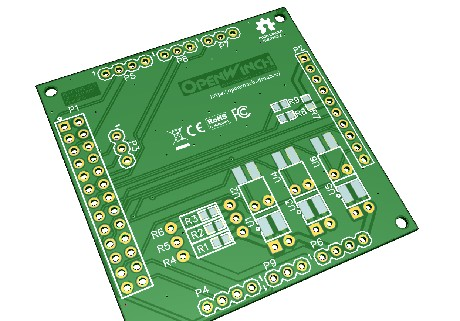
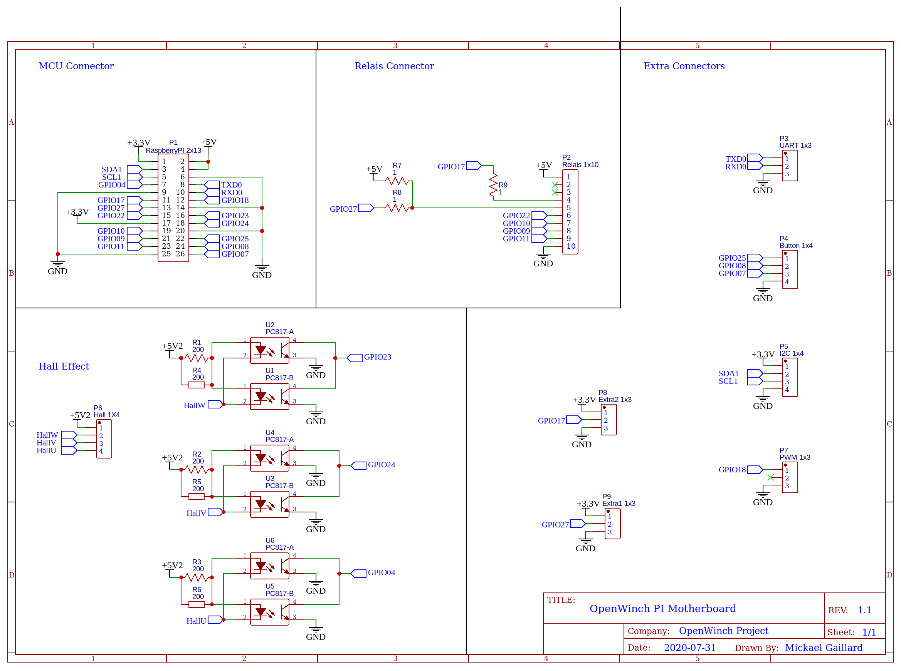
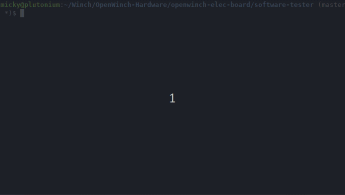

OpenWinch Electrical Hardware Board
===================================

GERBER file comming next...

## Testing Software

Available on `software-tester` folder.

Copy your config files:
- **constantes.py** 
- **hardware_config.py**

from your firmware board (specifical to components use : Board, Motor, MCU...).

And launcher `python3 board-tester.py`

many other individual tools for test available (*_tester) :
- **board_tester.py** complet tools for test standar component of OpenWinch
- **input_onoff_tester.py** Test On/off input
- **output_onoff_tester.py** Test On/off output
- **output_pwm_tester.py** test PWM output
- **tacho_tester.py** test hall sensor motor